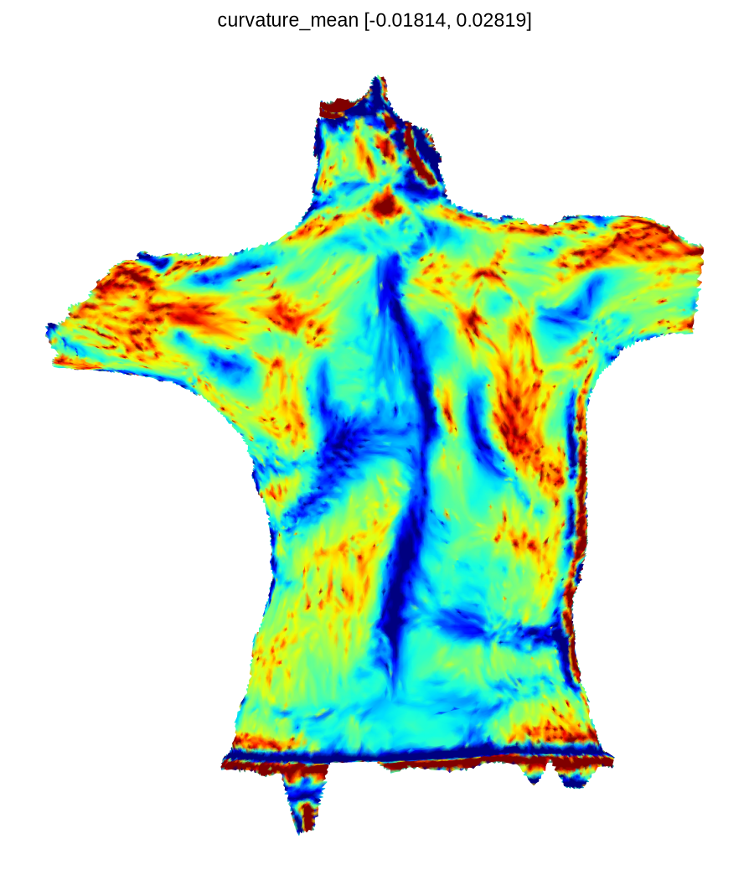
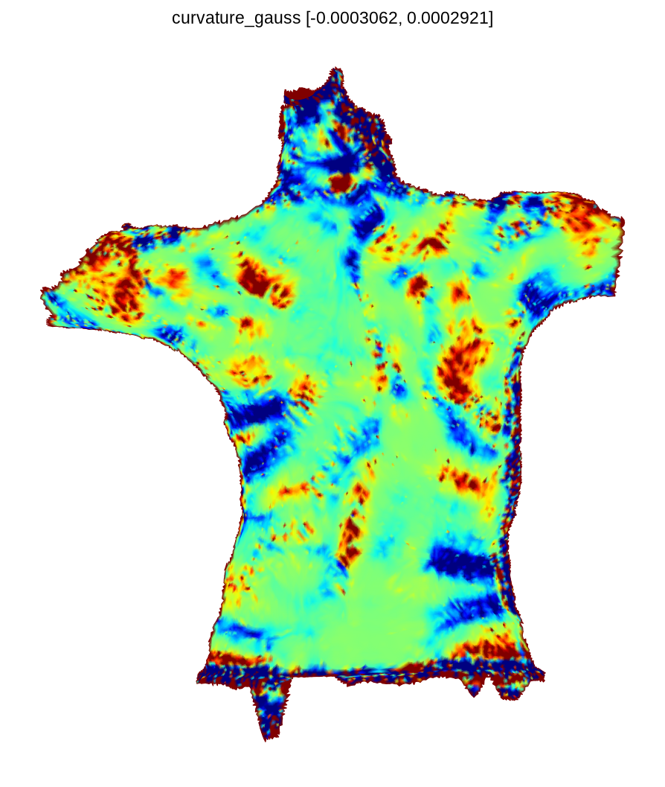
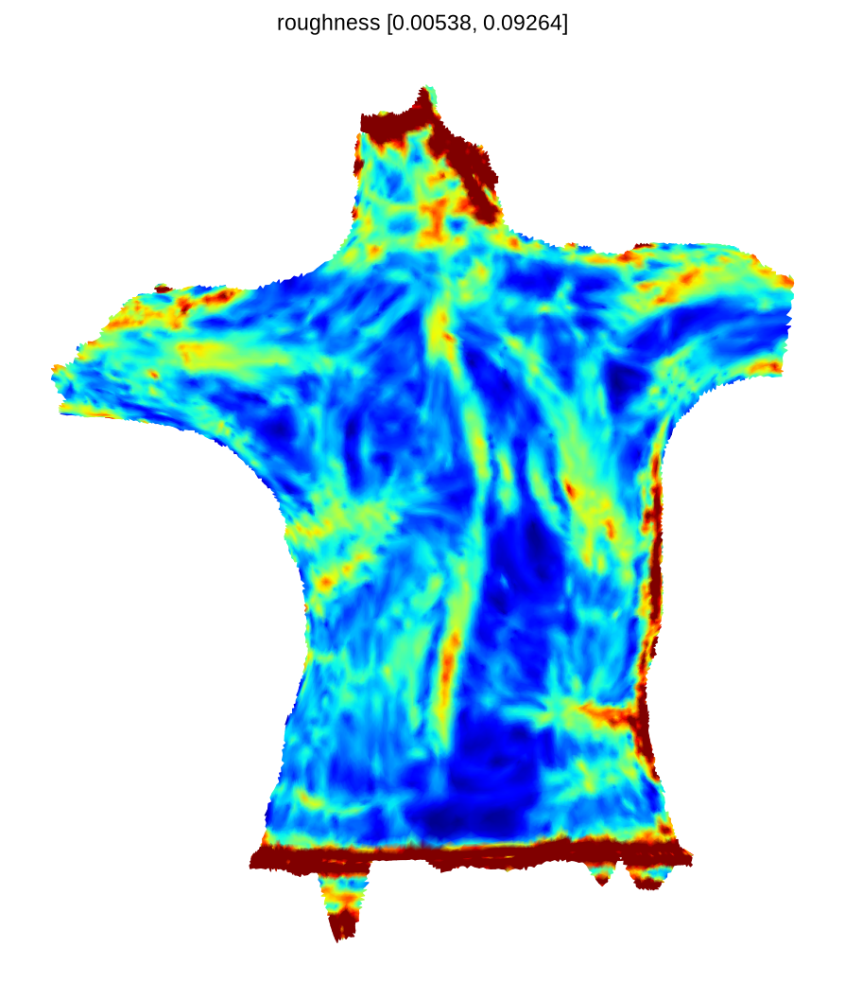
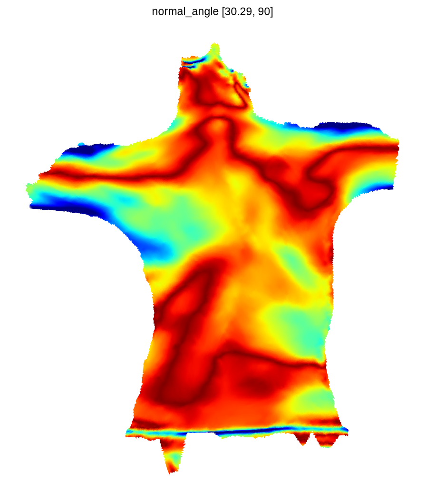
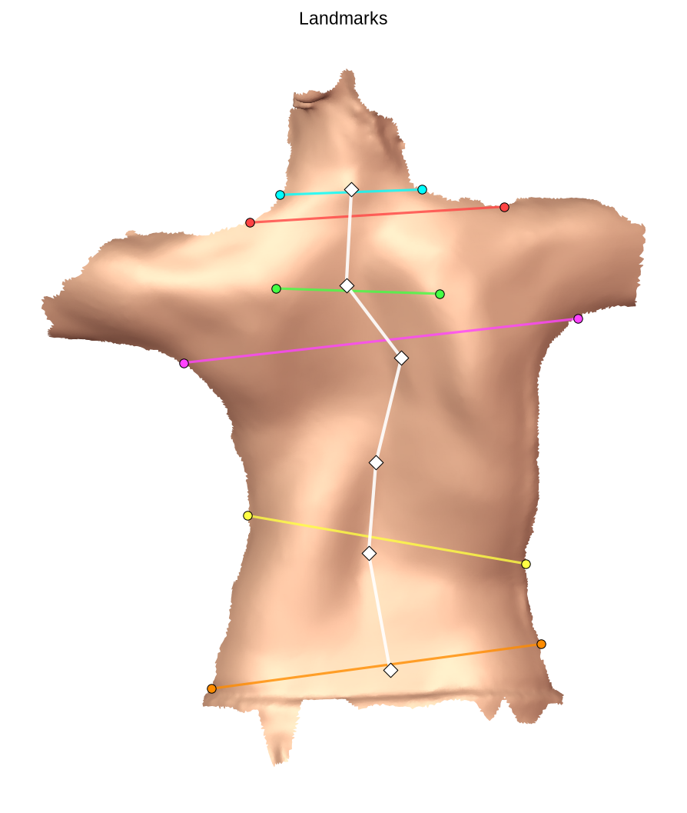
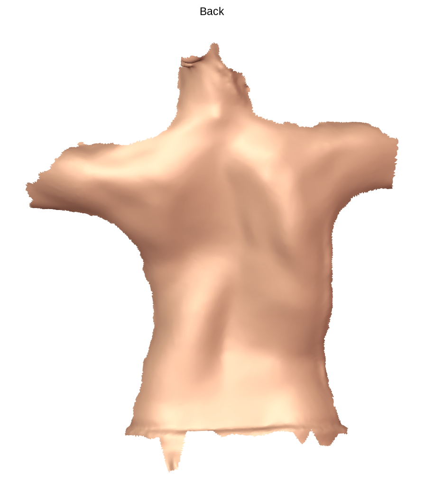
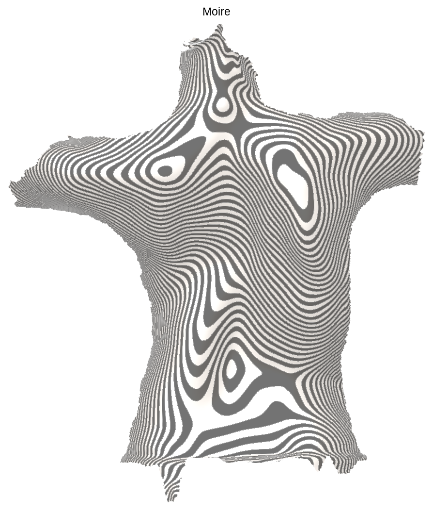
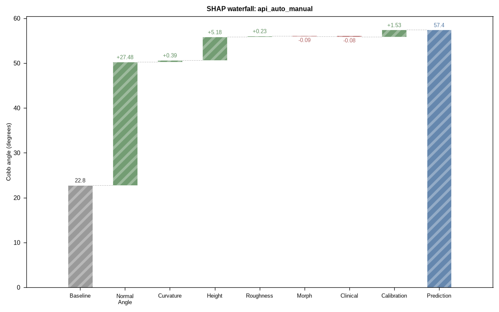

# AIS 预测 API

AIS 脊柱侧弯预测管线（`prediction/predict.py`）的对外封装，提供 **CLI ** 与 **HTTP API（FastAPI）** 两种调用方式。脚本与 API 共用同一预测管线，输出均落盘 `prediction/outputs/<subject_id>/`。

## 目录

- [启动 API 服务](#启动-api-服务)
- [脚本调用（CLI 三模式）](#脚本调用cli-三模式)
- [接口（HTTP API）](#接口http-api)
- [输出位置](#输出位置)
- [错误码](#错误码)

## 启动 API 服务

```bash
cd /home/nnb/projects/AIS/src/core
uv sync                                    # 首次使用先装依赖（详见根 README「环境构建」）
uvicorn prediction.api:app --host 0.0.0.0 --port 8000   # 默认 0.0.0.0:8000
uvicorn prediction.api:app --host 0.0.0.0 --port 9000   # 改端口
uvicorn prediction.api:app --host 0.0.0.0 --port 8000 --reload   # 开发热重载
```

交互式文档（Swagger UI）：`http://localhost:8000/docs` — 含请求/响应结构、错误码、curl 示例。

> 需在项目根（`core`）运行，管线依赖相对路径 `prediction/outputs` 等。

## 脚本调用（CLI 模式）

三种模式对应 PLY 输入两种形态：`landmarks` / `auto` 收**原始扫描 PLY**，`predict` 收**ROI PLY**（landmarks 产出的 `roi.ply`）。

```bash
# ① landmarks：原始扫描 PLY → landmarks.json + roi.ply（两段式第一段）
python -m prediction.cli landmarks --ply data/x.ply --subject S0001

# ② predict：ROI PLY + clinical + landmarks → cobb + 报告图（--landmarks 必填）
python -m prediction.cli predict --ply prediction/outputs/S0001/roi.ply --subject S0001 \
    --clinical data/form/clinical_data.json --landmarks prediction/outputs/S0001/landmarks.json

# ③ auto：原始扫描 PLY + clinical → 自动 landmarks → 预测（单步便捷入口）
python -m prediction.cli auto --ply data/x.ply --subject S0001 \
    --clinical data/form/clinical_data.json
```

模型选择（`--model`，缺省 `v1.0.0`）：`v1.0.0` = 生产模型；`v0.1.0` = 旧版模型

```bash
python -m prediction.cli predict --ply data/x.ply --subject S0001 \
    --clinical data/form/clinical_data.json \
    --landmarks prediction/outputs/S0001/landmarks.json --model v0.1.0
```

## 接口（HTTP API）

### POST /api/landmarks — 预处理（原始 PLY → ROI + landmarks）

输入 `original.ply`，输出 `landmarks.json` + `roi.ply`（落盘 `prediction/outputs/<sid>/`）。

```bash
curl -X POST http://localhost:8000/api/landmarks \
    -F "file=@data/ground_truth/23-10673/original.ply" \
    -F "subject_id=my_subject"      # 可选；缺省用文件名 stem + 时间戳
```

返回示例：

```json
{
  "subject_id": "readme_demo_lm",
  "landmarks": {
    "neck_root_L": [1.70, 49.63, -497.45],
    "neck_root_R": [108.00, 53.53, -489.59],
    "shoulder_transition_L": [-20.99, 28.82, -492.99],
    "shoulder_transition_R": [169.69, 40.69, -497.76],
    "scapular_peaks_L": [-1.31, -20.59, -477.08],
    "scapular_peaks_R": [121.42, -24.56, -466.93],
    "axilla_L": [-70.88, -76.34, -529.80],
    "axilla_R": [225.20, -43.18, -521.50],
    "waist_L": [-22.47, -190.80, -578.41],
    "waist_R": [185.87, -226.87, -558.22],
    "waist_lower_L": [-49.70, -320.49, -580.91],
    "waist_lower_R": [197.29, -287.13, -566.56],
    "neck_root_spine_point": [55.25, 53.62, -474.62],
    "scapular_spine_point": [51.42, -18.14, -487.67],
    "axilla_spine_point": [92.80, -72.66, -494.72],
    "waist_spine_point": [68.14, -219.15, -542.18],
    "waist_lower_spine_point": [84.21, -306.47, -533.87],
    "thoracic_spine_point": [73.62, -150.84, -525.03]
  },
  "outputs": {
    "roi": "prediction/outputs/readme_demo_lm/roi.ply"
  }
}
```

产出的 `roi.ply` + `landmarks.json` 可直接作为 predict 状态 2（predict）输入。

### POST /api/predict — 预测（双状态）

| 状态         | file 输入              | 必填 Form 字段                           | 说明                                    |
| ------------ | ---------------------- | ---------------------------------------- | --------------------------------------- |
| 1（auto）    | **original.ply** | `clinical`(JSON)                       | landmarks 自动检测                      |
| 2（predict） | **roi.ply**      | `clinical`(JSON) + `landmarks`(JSON) | landmarks 必须完整 18 键，缺失 422 拒绝 |

`model`（可选 Form 字段）：`v1.0.0`（缺省，生产）/ `v0.1.0`（历史）

```bash
# 状态 1（auto 先标注后预测）
curl -X POST http://localhost:8000/api/predict \
    -F "file=@data/ground_truth/23-10673/original.ply" \
    -F 'clinical={"gender":"Female","height_cm":150.5,"weight_kg":38.7}'

# 状态 1 + v0.1.0 模型
curl -X POST http://localhost:8000/api/predict \
    -F "file=@data/ground_truth/23-10673/original.ply" \
    -F 'clinical={"gender":"Female","height_cm":150.5,"weight_kg":38.7}' \
    -F "model=v0.1.0"

# 状态 2（predict 带landmark预测）
curl -X POST http://localhost:8000/api/predict \
    -F "file=@prediction/outputs/sid/roi.ply" \
    -F 'clinical={"gender":"Female","height_cm":150.5,"weight_kg":38.7}' \
    -F 'landmarks={"neck_root_L":[...],"neck_root_R":[...],...}'
```

返回示例（状态 1 auto 真实响应，landmarks 自动检测）：

```json
{
  "subject_id": "readme_demo_auto",
  "cobb": 57.43,
  "severity": "Severe",
  "model_id": "v1.0.0",
  "clinical": {
    "gender": "Female",
    "height_cm": 150.5,
    "weight_kg": 38.7
  },
  "indices": {
    "curvature_index": 27.5826,
    "height_index": 11.5131,
    "normal_angle_index": 26.9296,
    "roughness_index": 1.0498,
    "asymmetric_index": 34.4844
  },
  "body_params": {
    "Sh.IB": {"info": "左右肩垂直高度差(mm)", "value": 11.88},
    "Sh.A": {"info": "肩线倾角(deg)", "value": 3.56},
    "Sca.IB": {"info": "左右肩胛垂直高度差(mm)", "value": -3.97},
    "Sca.A": {"info": "肩胛线倾角(deg)", "value": -1.85},
    "ASIS.A": {"info": "腰线倾角(deg)", "value": 7.69},
    "Trunk.L": {"info": "躯干长度(mm)", "value": 338.57},
    "Sh.W": {"info": "肩宽(mm)", "value": 191.05},
    "Sh.AI": {"info": "肩不对称指数", "value": 0.67},
    "Pe.AI": {"info": "骨盆不对称指数", "value": 0.74}
  },
  "landmarks": {
    "neck_root_L": [1.70, 49.63, -497.45],
    "neck_root_R": [108.00, 53.53, -489.59],
    "shoulder_transition_L": [-20.99, 28.82, -492.99],
    "shoulder_transition_R": [169.69, 40.69, -497.76],
    "scapular_peaks_L": [-1.31, -20.59, -477.08],
    "scapular_peaks_R": [121.42, -24.56, -466.93],
    "axilla_L": [-70.88, -76.34, -529.80],
    "axilla_R": [225.20, -43.18, -521.50],
    "waist_L": [-22.47, -190.80, -578.41],
    "waist_R": [185.87, -226.87, -558.22],
    "neck_root_spine_point": [55.25, 53.62, -474.62],
    "scapular_spine_point": [51.42, -18.14, -487.67],
    "axilla_spine_point": [92.80, -72.66, -494.72],
    "waist_spine_point": [68.14, -219.15, -542.18],
    "waist_lower_L": [-49.70, -320.49, -580.91],
    "waist_lower_R": [197.29, -287.13, -566.56],
    "waist_lower_spine_point": [84.21, -306.47, -533.87],
    "thoracic_spine_point": [73.62, -150.84, -525.03]
  },
  "outputs": {
    "roi": "prediction/outputs/readme_demo_auto/roi.ply",
    "curvature_mean": "/reports/readme_demo_auto/report/curvature_mean.png",
    "curvature_gauss": "/reports/readme_demo_auto/report/curvature_gauss.png",
    "roughness": "/reports/readme_demo_auto/report/roughness.png",
    "normal_angle": "/reports/readme_demo_auto/report/normal_angle.png",
    "landmarks": "/reports/readme_demo_auto/report/landmarks.png",
    "back": "/reports/readme_demo_auto/report/back.png",
    "moire": "/reports/readme_demo_auto/report/moire.png",
    "waterfall": "/reports/readme_demo_auto/report/waterfall.png"
  }
}
```

返回示例（状态 2 predict 真实响应，仅预测字段 + 报告图，不返回 landmarks/roi）：

```json
{
  "subject_id": "readme_demo",
  "cobb": 57.54,
  "severity": "Severe",
  "model_id": "v1.0.0",
  "clinical": {
    "gender": "Female",
    "height_cm": 150.5,
    "weight_kg": 38.7
  },
  "indices": {
    "curvature_index": 27.6513,
    "height_index": 9.1332,
    "normal_angle_index": 28.969,
    "roughness_index": 3.4856,
    "asymmetric_index": 34.0864
  },
  "body_params": {
    "Sh.IB": {"info": "左右肩垂直高度差(mm)", "value": 11.88},
    "Sh.A": {"info": "肩线倾角(deg)", "value": 3.56},
    "Sca.IB": {"info": "左右肩胛垂直高度差(mm)", "value": -3.97},
    "Sca.A": {"info": "肩胛线倾角(deg)", "value": -1.85},
    "ASIS.A": {"info": "腰线倾角(deg)", "value": 7.69},
    "Trunk.L": {"info": "躯干长度(mm)", "value": 338.57},
    "Sh.W": {"info": "肩宽(mm)", "value": 191.05},
    "Sh.AI": {"info": "肩不对称指数()", "value": 0.67},
    "Pe.AI": {"info": "骨盆不对称指数()", "value": 0.74}
  },
  "outputs": {
    "curvature_mean": "/reports/readme_demo/report/curvature_mean.png",
    "curvature_gauss": "/reports/readme_demo/report/curvature_gauss.png",
    "roughness": "/reports/readme_demo/report/roughness.png",
    "normal_angle": "/reports/readme_demo/report/normal_angle.png",
    "landmarks": "/reports/readme_demo/report/landmarks.png",
    "back": "/reports/readme_demo/report/back.png",
    "moire": "/reports/readme_demo/report/moire.png",
    "waterfall": "/reports/readme_demo/report/waterfall.png"
  }
}
```

#### 报告图（8 张，静态服务 `/reports/<sid>/report/*.png`）

<table>
  <tr>
    <td align="center"><br>平均曲率热力图</td>
    <td align="center"><br>高斯曲率热力图</td>
  </tr>
  <tr>
    <td align="center"><br>粗糙度热力图</td>
    <td align="center"><br>法向角热力图</td>
  </tr>
  <tr>
    <td align="center"><br>Landmark 连线图</td>
    <td align="center"><br>原始背部渲染</td>
  </tr>
  <tr>
    <td align="center"><br>莫尔条纹</td>
    <td align="center"><br>SHAP 瀑布图</td>
  </tr>
</table>

> 热力图均为**物理空间**（x-y 投影）渲染，无坐标轴/外框。

## Landmarks 格式与转换

### 扁平 18 键（当前格式）

预测 API 输入、参数化、特征层与磁盘 `ground_truth.json` 统一使用**扁平 18 键**：
6 对 bilateral（`neck_root_L`/`neck_root_R` …）+ 6 个语义 spine 键。

```json
{
  "neck_root_L": [1.70, 49.63, -497.45],
  "neck_root_R": [108.00, 53.53, -489.59],
  "shoulder_transition_L": [-20.99, 28.82, -492.99],
  "shoulder_transition_R": [169.69, 40.69, -497.76],
  "scapular_peaks_L": [-1.31, -20.59, -477.08],
  "scapular_peaks_R": [121.42, -24.56, -466.93],
  "axilla_L": [-70.88, -76.34, -529.80],
  "axilla_R": [225.20, -43.18, -521.50],
  "waist_L": [-22.47, -190.80, -578.41],
  "waist_R": [185.87, -226.87, -558.22],
  "waist_lower_L": [-49.70, -320.49, -580.91],
  "waist_lower_R": [197.29, -287.13, -566.56],
  "neck_root_spine_point": [55.25, 53.62, -474.62],
  "scapular_spine_point": [51.42, -18.14, -487.67],
  "axilla_spine_point": [92.80, -72.66, -494.72],
  "waist_spine_point": [68.14, -219.15, -542.18],
  "waist_lower_spine_point": [84.21, -306.47, -533.87],
  "thoracic_spine_point": [73.62, -150.84, -525.03]
}
```

### 旧版嵌套格式

历史数据文件使用嵌套格式：`{name: {L: [...], R: [...]}}` + `spine_points` 数组
（`spine_points[0..5]` 依次对应上述 6 个 spine 键）。

```json
{
  "neck_root": {"L": [1.70, 49.63, -497.45], "R": [108.00, 53.53, -489.59]},
  "shoulder_transition": {"L": [-20.99, 28.82, -492.99], "R": [169.69, 40.69, -497.76]},
  "scapular_peaks": {"L": [-1.31, -20.59, -477.08], "R": [121.42, -24.56, -466.93]},
  "axilla": {"L": [-70.88, -76.34, -529.80], "R": [225.20, -43.18, -521.50]},
  "waist": {"L": [-22.47, -190.80, -578.41], "R": [185.87, -226.87, -558.22]},
  "waist_lower": {"L": [-49.70, -320.49, -580.91], "R": [197.29, -287.13, -566.56]},
  "spine_points": [
    [55.25, 53.62, -474.62],
    [51.42, -18.14, -487.67],
    [92.80, -72.66, -494.72],
    [68.14, -219.15, -542.18],
    [84.21, -306.47, -533.87],
    [73.62, -150.84, -525.03]
  ]
}
```

## 输出位置

每次请求结果落盘 `prediction/outputs/<subject_id>/`：

```
prediction/outputs/<subject_id>/
├─ input/original.ply / roi.ply + clinical.json   # 上传原始数据（按模式）
├─ roi.ply + landmarks.json             # ROI 与 landmarks
├─ param/<sid>/mesh_cut.ply + uv_coords.npy   # UV 参数化产物
├─ features.csv                         # 全量特征（调试用）
├─ prediction.json                      # cobb + 分级 + clinical + indices + body_params
└─ report/*.png                         # 8 张报告图（静态挂载 /reports/）
```

`prediction.json` 含：`cobb`/`severity`/`model_id`、`clinical`（身高体重等）、
`indices`（5 个不对称指数：curvature/height/normal_angle/roughness/asymmetric）、
`body_params`（9 个体征参数，带可读名+单位）。

## 错误码

| 状态码  | 含义                                                                 |
| ------- | -------------------------------------------------------------------- |
| `400` | 参数非法（clinical/landmarks 非 JSON、subject_id 含路径分隔符）      |
| `422` | 校验失败（非 .ply、clinical 缺字段、landmarks 不完整、PLY 无法解析） |
| `500` | 管线内部异常                                                         |

错误响应统一 `{"detail": "..."}`。

## 附录：旧版 → 扁平 转换

磁盘 GT 已统一为扁平 18 键。手头有旧版嵌套（或标注平台双边 list）数据时，用以下命令转成扁平：

```bash
python3 - old.json flat.json <<'PY'
import json, sys

src, dst = sys.argv[1], sys.argv[2]
data = json.load(open(src))
PAIRS = ["neck_root", "shoulder_transition", "scapular_peaks", "axilla", "waist", "waist_lower"]
SPINE = ["neck_root_spine_point", "scapular_spine_point", "axilla_spine_point",
         "waist_spine_point", "waist_lower_spine_point", "thoracic_spine_point"]

flat = {}
for name in PAIRS:
    val = data.get(name)
    if isinstance(val, dict):                 # 旧嵌套 {name: {L, R}}
        L, R = val.get("L"), val.get("R")
    elif isinstance(val, list) and val:       # 标注平台双边 list {name: [L, R]}
        L, R = val[0], val[1] if len(val) > 1 else None
    else:
        continue
    if L:
        flat[f"{name}_L"] = L
    if R:
        flat[f"{name}_R"] = R
spine = data.get("spine_points", [])
for i, key in enumerate(SPINE):
    if i < len(spine) and spine[i]:
        flat[key] = spine[i]
json.dump(flat, open(dst, "w"), ensure_ascii=False, indent=2)
print(f"converted {src} → {dst}（{len(flat)} 键）")
PY
```
