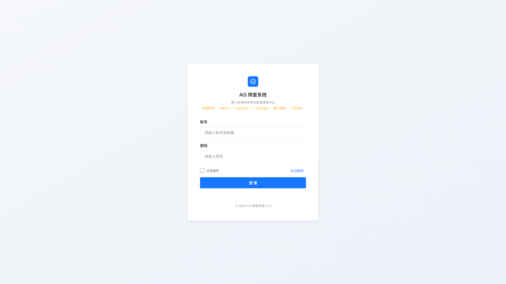
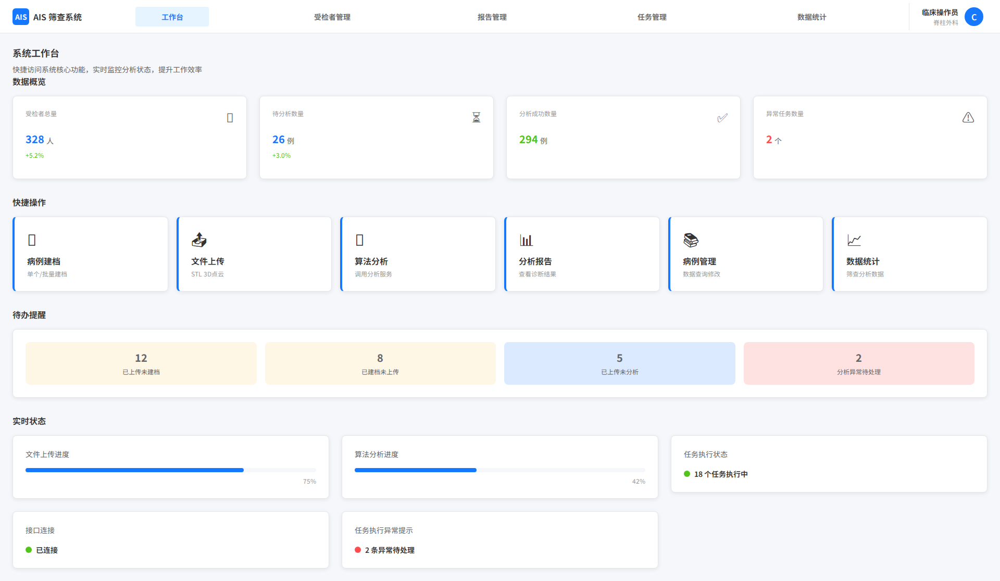
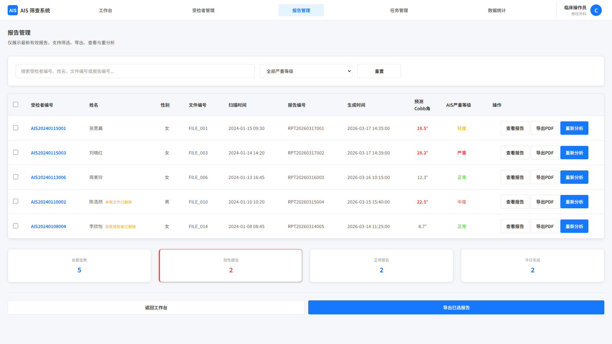

# AIS 筛查系统 — 产品概述与文档导航

## 产品定位

本系统核心定位为 **UI 展示与操作入口**，不参与扫描设备控制、数据预处理及算法中间过程，通过 API 调用独立算法服务，实现完整筛查闭环：

> **受检者建档 → 3D扫描文件上传 → 算法分析 → 报告生成**

## 关键原则

- **UI 独立性** — 不控制扫描设备，不参与数据预处理，不展示算法中间过程
- **接口规范性** — 通过标准 API 与算法服务通信，接口配置灵活可调整；参见 [API 约定](API文档/01-分析算法API约定.md)
- **结果直观化** — 算法输出影像和数值以可视化方式展示，无需用户理解算法逻辑
- **权限安全性** — 严格区分管理员与普通用户权限，全部关键操作日志可追溯

---

## 角色权限

|  | 管理员 | 普通用户（临床操作员）|
|---|---|---|
| 核心定位 | 系统全局管理者，负责用户管理、接口配置、系统运维及全量数据管控 | 临床业务操作者，仅负责受检者筛查核心业务，无系统管理权限 |
| 数据范围 | 全系统受检者数据，可按用户、科室等维度筛选 | 仅本账户操作的受检者数据 |
| 业务页面 | 全部可访问 | 全部可访问 |
| 管理员专属页面 | 用户管理、算法接口配置、系统设置 | 不可访问 |
| 账号要求 | 必须绑定邮箱或手机号（首次登录前强制完成） | 同左 |

---

## 系统页面结构总览

### 跨页面主流程导航

1. 用户通过 [其他页面/01-登录.md](其他页面/01-登录.md) 登录并完成首次绑定校验后进入 [其他页面/02-工作台.md](其他页面/02-工作台.md)
2. 在 [核心业务/01-受检者管理.md](核心业务/01-受检者管理.md) 中完成单个建档或批量建档
3. 在 [核心业务/02-文件上传.md](核心业务/02-文件上传.md) 中上传 3D扫描文件并建立受检者关联
4. 在 [核心业务/03-算法调用.md](核心业务/03-算法调用.md) 中发起单个或批量分析任务
5. 在 [核心业务/04-报告分析.md](核心业务/04-报告分析.md) 中查看分析结果、编辑诊断意见并导出报告
6. 通过 [其他页面/03-任务管理.md](其他页面/03-任务管理.md) 跟踪异步任务，通过 [其他页面/04-数据统计.md](其他页面/04-数据统计.md) 做业务复盘与数据分析

### 公共页面（所有角色）

- **登录页** — 账号密码登录、密码找回、首次绑定引导
- **工作台** — 登录后默认首页，数据概览 + 快捷操作 + 待办提醒 + 实时状态
- **个人设置页** — 个人信息、密码管理、邮箱/手机号绑定
- **帮助页** — 操作指南、FAQ、异常排查、联系支持

### 核心业务页面（所有角色，按权限展示不同数据范围）

- **受检者管理页** — 受检者列表，支持筛选/排序/批量操作
  - **受检者详情页** — 基础信息模块 + 文件与报告模块
  - **受检者建档页** — 单个建档表单 / 批量建档（Excel 导入）
- **文件上传页** — 单文件上传 / 批量上传列表页
- **算法调用页** — 发起单个或批量分析，可前台等待或后台执行
- **报告列表页** — 所有已生成报告，支持筛选/排序/批量导出
  - **报告详情页** — 受检者信息 + 文件信息 + 算法结果（影像+指标）+ 诊断意见（可编辑），支持版本管理
- **数据统计页** — 受检者分布、核心指标、严重程度分布、算法调用统计、自定义导出
- **任务管理页** — 所有异步任务记录（建档/上传/分析）
  - **批量任务详情页** — 顶部统计 + 子任务列表 + 批量操作
  - **单个任务详情页** — 执行链路 + 关联数据 + 操作按钮

### 管理员专属页面

- **用户管理页** — 用户增删改查、角色分配、绑定管理、密码重置
- **系统设置页** — 基础配置、数据管理、日志、算法接口配置、安全策略（含密码规则）

---

## 文档导航

### 核心业务

| 页面 | 文档 | 覆盖的页面与能力 |
|---|---|---|
| 受检者管理 | [01-受检者管理.md](核心业务/01-受检者管理.md) | 受检者列表页、受检者详情页、单个建档页、批量建档页 |
| 文件上传 | [02-文件上传.md](核心业务/02-文件上传.md) | 单文件上传页、批量上传入口与列表页、详情页内文件管理 |
| 算法调用 | [03-算法调用.md](核心业务/03-算法调用.md) | 单个分析流程、批量分析流程、批量结果列表页 |
| 报告分析 | [04-报告分析.md](核心业务/04-报告分析.md) | 报告列表页、报告详情页（含诊断编辑与版本管理） |

### 其他页面

| 页面 | 文档 | 访问权限 |
|---|---|---|
| 登录 | [01-登录.md](其他页面/01-登录.md) | 全部用户 |
| 工作台 | [02-工作台.md](其他页面/02-工作台.md) | 全部（角色决定展示内容差异） |
| 任务管理 | [03-任务管理.md](其他页面/03-任务管理.md) | 全部（管理员见全系统任务，普通用户见本人任务） |
| 数据统计 | [04-数据统计.md](其他页面/04-数据统计.md) | 全部（管理员见全量数据，普通用户见本人数据） |
| 个人设置 | [05-个人设置.md](其他页面/05-个人设置.md) | 全部用户 |
| 系统设置 | [06-系统设置.md](其他页面/06-系统设置.md) | 仅管理员 |
| 用户管理 | [07-用户管理.md](其他页面/07-用户管理.md) | 仅管理员 |
| 帮助 | [08-帮助.md](其他页面/08-帮助.md) | 全部（角色决定可见内容差异） |

### API 文档

| 文档 | 链接 |
|---|---|
| 分析算法 API 约定 | [01-分析算法API约定.md](API文档/01-分析算法API约定.md) |

## 页面截图索引

- 登录页：
- 工作台：
- 受检者管理：
- 任务管理：
- 报告管理：

