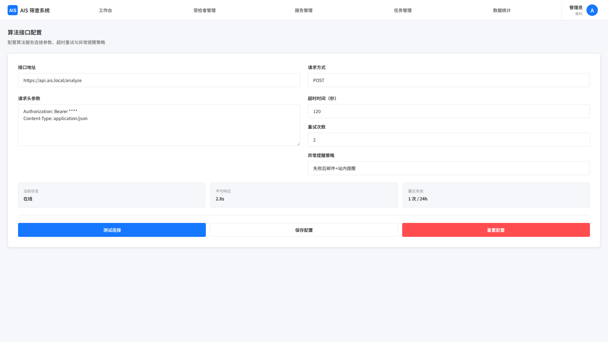

# 分析算法 API 约定

## 1. 页面范围

- 接口基本信息
- 输入参数定义
- 输出参数定义
- 调用流程
- 异常约定

## 2. 页面定位

本系统作为独立 UI 服务，通过 API 与算法服务通信。本文用于统一联调和展示口径。

## 3. 页面结构

### 3.1 接口基本信息

- 接口名称：AIS 筛查算法服务接口
- 请求方式：POST
- 请求 Content-Type：multipart/form-data + application/json
- 响应格式：application/json
- 超时时间：默认 30 秒
- 重试次数：默认 3 次

### 3.2 输入参数

说明：接口字段名需与算法服务约定保持一致，其中 `stlFile` 为固定参数名，不做重命名；`patientInfo` 作为 multipart 表单中的 JSON 字符串字段传递。

| 参数名称 | 参数类型 | 必填 | 描述 |
|---|---|---|---|
| caseId | String | 是 | UI 系统生成的唯一受检者编号 |
| stlFile | File | 是 | 3D扫描文件（STL格式），单文件不超过 100MB |
| patientInfo | JSON Object | 否 | 受检者基础信息，如姓名、性别、年龄 |

### 3.3 输出参数

算法处理完成后返回以下结果，所有影像类字段返回 Base64 编码格式，坐标类返回像素坐标（基于 2D 背部图片）：

| 输出项 | 参数名称 | 参数类型 | 描述 |
|---|---|---|---|
| 背部图像 | back2dImage | String（Base64） | 2D 背部图片，清晰展示背部整体形态 |
| 标注坐标 | annotationCoordinates | JSON Object | 含体表脊柱中线、左右肩峰连线、左右肩胛骨最高点连线、肋骨下缘位置、骨盆位置 |
| 曲率热力图 | backCurvatureHeatmap | String（Base64） | 2D 背部曲率热力图，色阶对应曲率大小 |
| 不对称指数 | asymmetricIndex | Double | Asymmetric Index，保留 2 位小数 |
| Z 指数 | zIndex | Double | Z Index，保留 2 位小数 |
| 莫尔影像 | moireImage | String（Base64） | Moire Image，展示背部不对称条纹 |
| 莫尔数 | moireNumber | Integer | Moire Number，背部不对称条纹数量 |
| 预测科布角 | predictedCobbAngle | Double | 预测 Cobb Angle（科布角），单位度（°），保留 1 位小数 |
| 响应状态码 | code | Integer | 200（成功）、400（参数错误）、500（算法处理失败） |
| 响应信息 | message | String | 成功时为"处理成功"，失败时为具体错误原因 |

### 3.4 接口调用流程

1. UI 完成受检者建档，上传 3D扫描文件（STL格式）并绑定至对应受检者；
2. 用户点击"发起分析"，UI 组装参数（`caseId`、`stlFile`、可选 `patientInfo`）；
3. UI 通过配置好的 API 地址向算法服务发送 POST 请求；
4. 算法服务校验参数及文件格式，若异常返回对应错误码；
5. 算法服务处理文件，生成 10 项核心输出，返回给 UI；
6. UI 接收响应：成功则解析并展示；失败则展示错误信息并支持重试。

### 3.5 接口异常约定

| 状态码 | 常见原因 | UI 处理方式 |
|---|---|---|
| 400 | caseId 缺失、stlFile 未上传、文件格式错误、文件过大 | 展示具体错误信息，引导用户修正 |
| 500 | 文件数据异常、算法服务内部错误 | 展示错误信息，支持重新上传文件并重试 |
| 连接失败 | 无法连接算法服务 | 提示"接口连接异常，请检查接口配置"，引导管理员排查 |

## 4. 关键规则

- UI 不参与算法内部过程，只负责参数组织、调用、结果展示、错误提示
- 结果字段命名与报告分析、数据统计模块保持一致
- 接口配置、超时、重试策略与系统设置页保持一致
- `stlFile` 为固定接口参数名，不做字段名替换
- 输出结果中的图片字段需与报告分析页的影像展示口径保持一致

## 5. 相关联动

- 与核心业务算法调用文档保持一致
- 与报告分析文档保持结果口径一致
- 与系统设置文档保持配置口径一致

## 6. 页面截图

