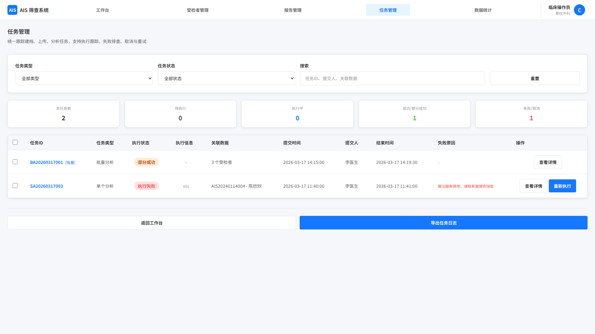
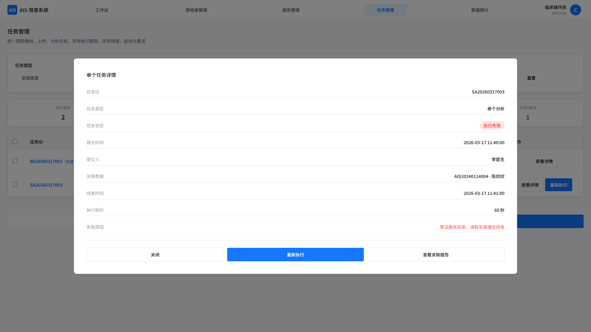
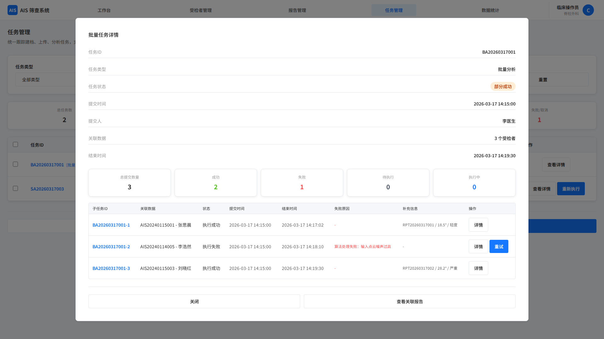

# 任务管理

## 1. 页面范围

- 任务列表页
- 批量任务详情页
- 单个任务详情页

## 2. 页面定位

任务页统一管理建档、上传、分析等3类任务，提供执行跟踪、失败排查、取消与重试能力。

状态口径说明：

- 任务主状态统一为：待执行、执行中、执行成功、执行失败、已取消
- 仅批量任务允许出现聚合状态“部分成功”，用于表示同一批次中同时存在成功与失败子任务
- 分析任务的阶段状态如等待中、上传中、分析中，仅在算法调用页和批量结果列表页中展示，不替代任务主状态

## 3. 页面结构

### 3.1 任务列表页

覆盖任务类型：

- 单个建档、批量建档
- 单文件上传、批量文件上传
- 单个分析、批量分析

统一状态：

- 待执行、执行中、执行成功、执行失败、已取消

核心字段：

- 任务 ID、任务类型、提交信息、关联数据、执行状态、执行耗时

列表核心规则：

- 默认按任务提交时间倒序排列，单个任务与批量任务统一展示
- 批量任务需带“批量”标识，便于快速区分
- 失败任务展示简要失败原因，执行中任务展示实时进度
- 管理员可查看全系统任务，普通用户仅可查看本人任务

列表字段细化：

- 任务基础信息：任务 ID、任务类型
- 提交信息：提交人、提交时间
- 关联数据：单个任务显示受检者编号或文件名称；批量任务显示关联受检者/文件总数
- 执行信息：执行状态、执行进度、结束时间、失败原因

状态化操作：

- 待执行：查看详情、取消任务
- 执行中：查看详情
- 执行成功：查看详情、重新执行
- 执行失败：查看详情、重新执行
- 已取消：查看详情、重新执行

列表辅助功能：

- 筛选：按任务类型、执行状态、提交时间、提交人等筛选
- 排序：按任务提交时间、结束时间、任务 ID 等升降序
- 搜索：支持搜索任务 ID、提交人、关联受检者编号/文件名称
- 批量操作：批量取消（仅待执行）、批量重试（仅成功/失败/已取消）

### 3.2 批量任务详情页

页面定位：统一展示单个批量任务的整体执行概况、子任务详情及异常信息，支持批量或单个子任务操作。

顶部信息：

- 任务基础信息：任务 ID、任务类型
- 提交信息：提交人、提交时间
- 执行状态：待执行、执行中、成功、部分成功、失败、已取消

专属统计项：

- 批量建档：总提交数量、重复数量、校验失败数量、成功数量、失败数量、待执行数量
- 批量上传：总提交数量、重复数量、校验失败数量、成功数量、失败数量、待执行数量
- 批量分析：总提交数量、成功数量、失败数量、待执行数量

子任务字段：

- 任务 ID、任务类型、执行状态、提交时间、结束时间、失败原因
- 补充字段
    - 建档：受检者编号、姓名、性别、生日
    - 上传：文件编号、路径、文件大小
    - 分析：报告编号、Cobb Angle、严重程度
- 行内操作：
    - 重试（仅失败/已取消子任务）
    - 取消（仅待执行子任务）

底部操作按钮（批量操作需选中符合要求的子任务）：

- 执行中：批量取消、返回列表
- 已结束：批量重试、返回列表

### 3.3 单个任务详情页

页面由5个区域组成：

- 任务基础信息区：任务 ID、任务类型、
- 提交信息：提交人、提交时间
- 执行详情区：执行状态、结束时间、失败原因
- 专属数据区：见下文描述
- 操作按钮区：根据状态显示取消任务、重新执行、返回任务列表

专属数据按任务类型划分，可以点击编号跳转到对应的关联数据的详情页：
- 建档：受检者编号、姓名、性别、生日
- 上传：文件编号、路径、文件大小
- 分析：报告编号、Cobb Angle、严重程度

## 4. 关键规则

- 管理员可查看全系统任务，普通用户仅查看本人任务
- 日志默认保留 3 个月，可配置
- 取消、重试等敏感操作需确认并记录日志

## 5. 页面截图

