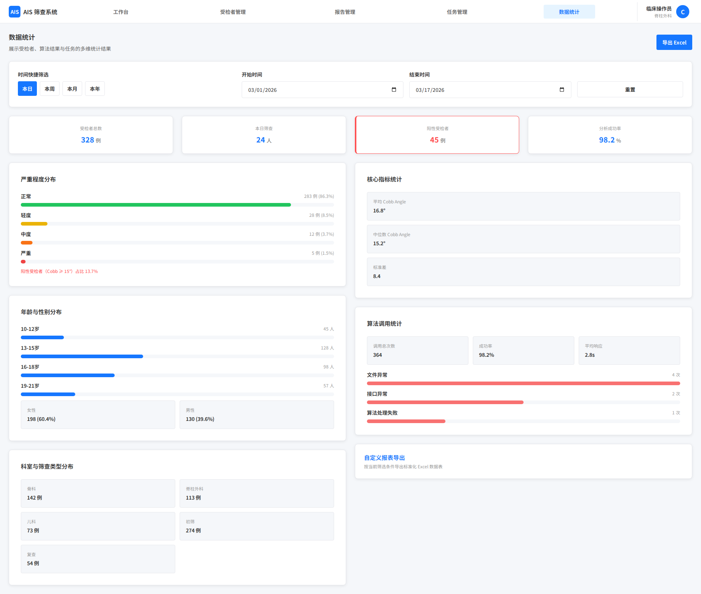

# 数据统计

## 1. 页面范围

- 统计看板
- 条件筛选
- 数据导出

## 2. 页面定位

统计页用于展示受检者与算法结果的多维数据，支撑筛查复盘、临床研究与管理决策。

## 3. 页面结构

### 3.1 统计看板

受检者基础统计：

- 受检者总数
- 时间范围分布
- 科室分布
- 筛查类型分布
- 年龄与性别分布

核心指标统计：

- Asymmetric Index、Z Index、Moire Number、Cobb Angle

严重程度分布：

- 按 AIS 严重等级统计各等级数量及占比
- 突出阳性受检者（Cobb Angle ≥ 15°）占比，支撑临床筛查重点判断

算法调用统计：

- 算法调用总次数、成功率、平均响应时间
- 支持按时间范围拆分统计
- 展示失败调用的主要原因分布（如文件异常、接口异常）

### 3.2 筛选能力

- 时间快捷筛选：本日、本周、本月、本年，默认展示本日统计结果
- 自定义时间范围：支持选择开始时间与结束时间
- 受检者范围筛选：支持从受检者管理页带入选中受检者执行专项统计
- 管理员扩展筛选：操作者、科室
- 普通用户仅展示本人权限范围内的数据，不提供跨用户筛选能力

### 3.3 自定义报表

**时间范围筛选：**

- 快捷切换：本日、本周、本月、本年，点击即可切换，默认展示本日数据
- 自定义时间：弹出日期选择器，可手动选取起止时间

**受检者范围筛选：**

- 支持从受检者管理页带入选中受检者进行专项统计
- 管理员额外支持按操作者、科室维度统计

### 3.4 导出能力

- 按当前筛选条件导出 Excel 标准化数据表格
- 包含受检者基础信息与核心筛查指标（asymmetricIndex、zIndex、moireNumber、predictedCobbAngle、AIS 严重等级）
- 适配临床研究数据整理需求

## 4. 关键规则

- 统计口径与受检者、报告、任务等业务数据保持一致
- 管理员看全量，普通用户看本人范围
- 导出结果必须与当前筛选一致
- 统计页中的成功率、异常原因分布、严重程度分布需与任务页、算法调用页、报告分析页保持一致

## 5. 相关联动

- 与受检者管理联动：支持带入选中受检者统计
- 与算法调用/报告分析联动：结果进入统计口径
- 与工作台联动：摘要口径一致

## 6. 页面截图

