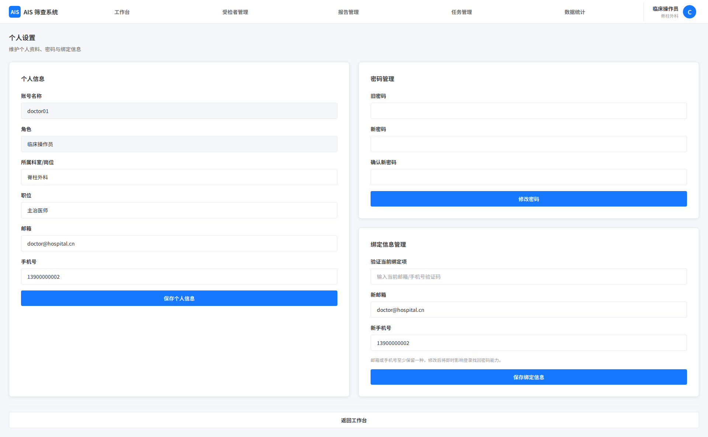

# 个人设置

## 1. 页面范围

- 个人信息管理
- 密码管理
- 邮箱/手机号绑定管理

## 2. 页面定位

个人设置页用于当前登录用户维护个人资料与账号安全信息，是登录与找回密码能力的基础支撑页面。

## 3. 页面结构

### 3.1 个人信息

- 展示字段：账号名称、角色、所属科室/岗位、联系信息、当前绑定状态
- 仅允许修改本人可编辑信息，角色、账号标识等系统字段不可自行修改
- 修改成功后需即时同步到当前登录态展示信息

### 3.2 密码管理

1. 输入旧密码
2. 输入新密码并二次确认
3. 校验复杂度和有效期策略
4. 修改成功后提示

异常场景：

- 旧密码错误时，禁止提交并给出明确提示
- 新密码不满足复杂度要求时，实时展示校验失败原因
- 新密码与确认密码不一致时，不允许保存

### 3.3 绑定信息管理

- 支持绑定邮箱、绑定手机号，至少保留其中一种
- 更换绑定信息前，需先验证当前已绑定项
- 若当前仅绑定一种方式，则不允许直接解绑，必须先补充另一种绑定方式或同步完成替换

操作流程：

1. 用户选择绑定或更换邮箱/手机号。
2. 系统校验当前绑定状态。
3. 若为变更操作，先验证当前绑定项。
4. 输入新的邮箱或手机号并完成验证。
5. 保存成功后更新绑定状态，并记录变更日志。

## 4. 关键规则

- 邮箱或手机号至少绑定一种
- 未绑定用户限制核心功能使用
- 仅允许修改本人信息
- 密码修改、绑定变更均需满足系统设置下发的统一安全策略
- 绑定状态变化需即时影响登录找回密码能力

## 5. 页面截图

