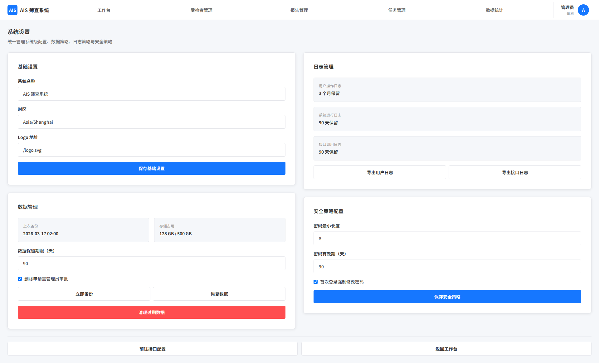

# 系统设置

## 1. 页面范围

- 基础设置
- 数据管理
- 日志管理
- 算法接口配置
- 安全策略配置

## 2. 页面定位

系统设置页仅管理员可见，用于统一管理系统级配置与运维策略。

## 3. 页面结构

### 3.1 基础设置

- 系统名称、Logo、时区等基础信息配置

### 3.2 数据管理

- 数据备份/恢复/导出
- 删除审批
- 数据保留期限
- 过期数据清理
- 存储占用展示

操作要求：

- 备份与恢复需展示执行状态、执行时间、操作人
- 清理过期数据前必须二次确认，并明确清理范围
- 数据保留期限需支持配置，并与任务日志、操作日志保留策略保持一致

### 3.3 日志管理

- 用户操作日志、系统运行日志、接口调用日志
- 支持筛选与导出

日志维度：

- 用户操作日志：登录、退出、数据新增/修改/删除、报告保存、权限变更
- 系统运行日志：任务执行、异常告警、系统级配置变更
- 接口调用日志：调用时间、受检者编号、响应状态、响应时长、错误信息

### 3.4 算法接口配置

- 接口地址、请求方式、请求头参数
- 连接测试
- 超时时间和重试次数
- 异常提醒策略

配置要求：

- 支持保存、修改、重置接口参数
- 支持点击“测试连接”即时验证连通性，并展示失败原因
- 接口超时时间、重试次数需与算法调用页实际执行策略一致

### 3.5 安全策略配置

- 密码复杂度、密码有效期、定期修改策略
- 支持设置密码长度、字符类型要求、失效周期
- 支持配置首次登录强制修改密码策略
- 相关策略需同步影响登录页和个人设置页的校验行为

## 4. 关键规则

- 仅管理员可访问
- 系统级敏感操作需二次确认
- 接口配置需支持连接测试与异常告警
- 所有系统级配置变更需记录日志
- 备份、恢复、清理、接口重置等敏感操作应保留完整操作审计
- 系统级配置修改后需保证前后端口径一致，避免业务页展示与配置规则脱节

## 5. 页面截图

