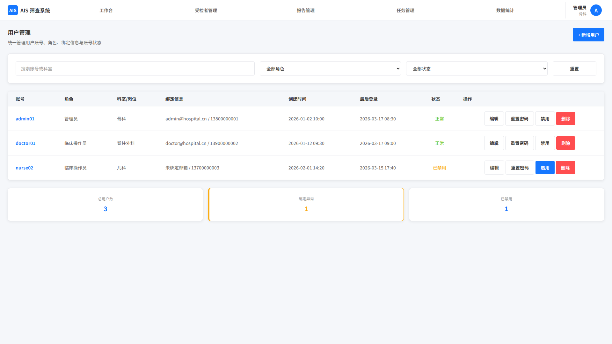

# 用户管理

## 1. 页面范围

- 用户新增
- 用户编辑
- 用户删除/禁用
- 用户查询与筛选
- 初始密码重置

## 2. 页面定位

用户管理页仅管理员可见，用于统一管理系统账号、角色、绑定信息与账号状态。

## 3. 页面结构

### 3.1 用户新增

- 输入项：账号名称、角色、所属科室/岗位、绑定信息（邮箱或手机号至少一种）
- 初始密码可自动生成或手动设置；首次登录后需强制重置
- 新增完成后账号进入可登录状态，并记录创建人、创建时间

### 3.2 用户编辑与状态管理

- 可编辑角色、密码、绑定信息、科室/岗位
- 支持禁用、解除禁用、删除账号
- 修改绑定信息时，需通过原绑定邮箱/手机号完成验证
- 删除前需二次确认；删除后账号不可登录，但历史操作记录必须保留

### 3.3 用户查询与列表

- 筛选：账号名称、角色、科室、绑定方式、状态
- 字段：账号、角色、绑定信息、科室、创建时间、最后登录时间、状态

列表辅助能力：

- 支持按账号名称、角色、所属科室、绑定方式、账号状态组合筛选
- 支持排序与搜索
- 支持重置初始密码、禁用/启用、编辑、删除等行内操作

附加管理能力：

- 绑定信息管理：查看未绑定、绑定异常的用户并发送提醒
- 初始密码重置：当用户无法通过绑定方式找回密码时，由管理员重置并通知用户

## 4. 关键规则

- 仅管理员可访问和操作
- 用户必须绑定邮箱或手机号至少一种
- 删除、禁用、角色变更、密码重置等需确认并记录日志
- 删除后账号不可登录但历史日志保留
- 普通用户不可访问本页，也不可通过接口间接修改其他用户信息
- 用户状态、角色、绑定信息变更需即时影响登录页、工作台权限和个人设置展

## 5. 页面截图

