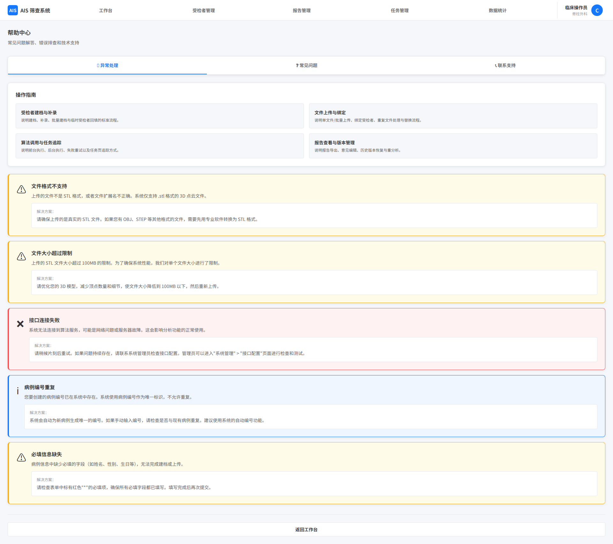

# 帮助

## 1. 页面范围

- 帮助中心
- 异常处理指引
- 联系支持入口

## 2. 页面定位

帮助页用于提供系统操作说明、常见问题与异常排查路径。

## 3. 页面结构

### 3.1 帮助中心

面向所有用户：

- 核心业务操作指南（建档、上传、分析、报告）
- 常见问题（FAQ）
- 联系支持入口

管理员专属：

- 接口配置指南
- 用户管理指南
- 系统设置与日志管理排查指南

展示规则：

- 普通用户仅展示业务操作指南、自助排查说明和普通用户 FAQ
- 管理员额外展示接口配置、用户管理、系统设置、日志排查等高级帮助内容

### 3.2 异常处理指引

- 文件上传异常
- 接口调用异常
- 用户相关异常
- 普通用户提供自助步骤，管理员提供排查入口

异常处理范围：

- 文件上传异常：格式错误、文件损坏、大小超限、重复文件
- 接口调用异常：接口连接失败、算法服务超时、返回结果异常
- 用户相关异常：绑定异常、登录失败、账号禁用/删除
- 其他异常：页面加载失败、数据获取失败、权限不足

### 3.3 反馈与跟踪

- 一键反馈问题
- 留言记录查询
- 常见问题更新提示

- 提供技术支持电话、邮箱或在线留言入口
- 管理员可查看留言汇总与处理状态

## 4. 关键规则

- 帮助内容按角色分级展示
- 异常处理优先给出可执行动作
- 管理员排查指引与系统规则保持一致
- 帮助内容需与当前系统配置、接口口径、权限规则保持同步

## 5. 页面截图

