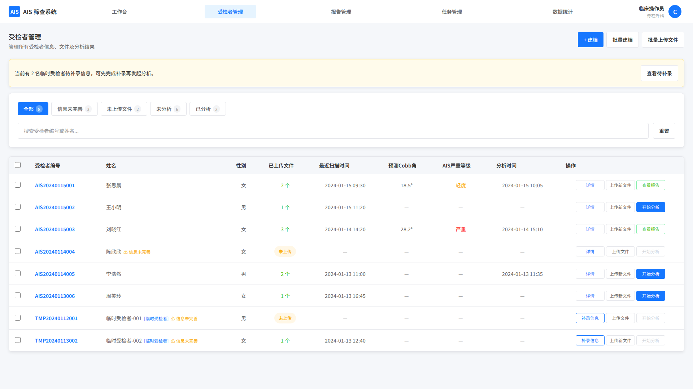
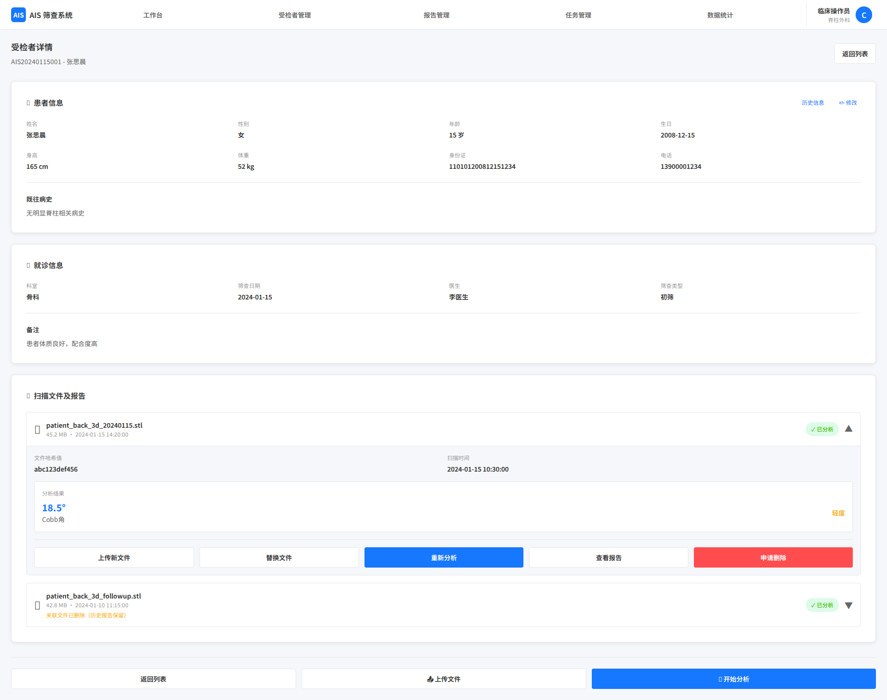
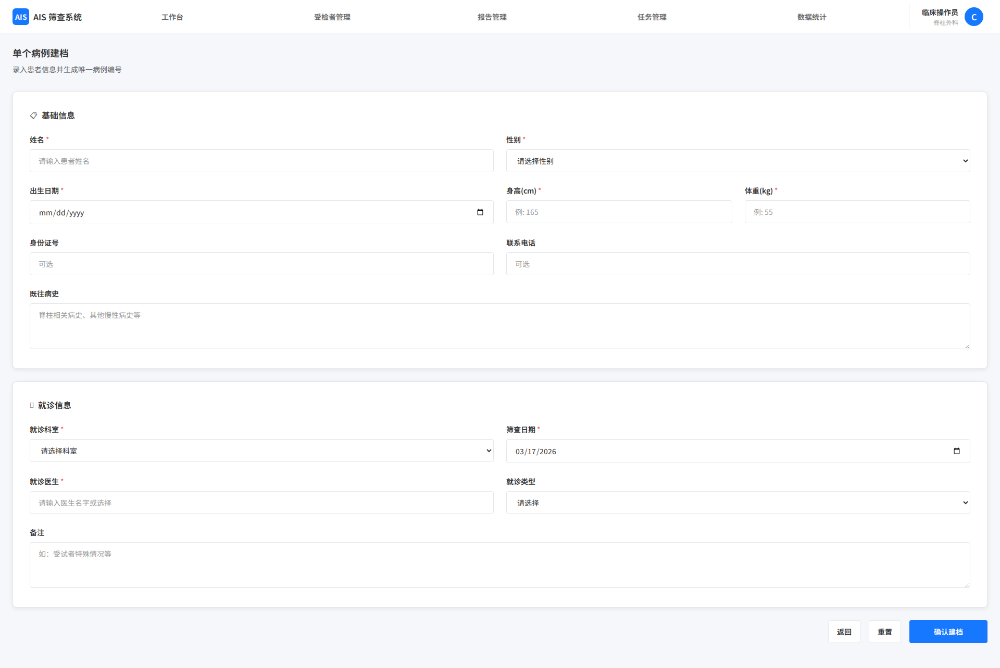
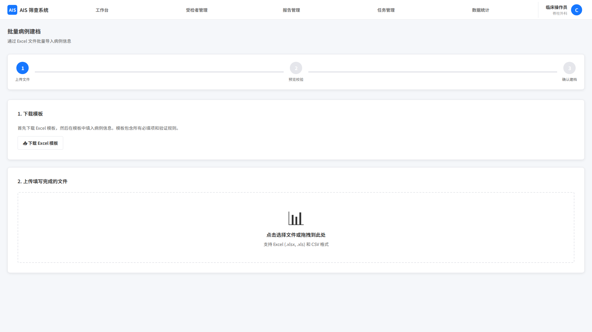

# 受检者管理

## 1. 页面范围

本文件覆盖以下页面和能力：

- 受检者列表页
- 受检者详情页
- 受检者建档页

## 2. 页面定位

受检者管理是业务闭环的起点和主索引，负责受检者信息录入、列表管理、详情查看、信息修改，以及与文件上传、算法调用、报告分析模块的衔接。

## 3. 页面结构

### 3.1 受检者列表页

列表核心规则：

- 管理员可查看和管理全系统受检者，普通用户仅查看本人权限范围内受检者
- 未录入或必填信息未完善的受检者需在列表中提示
- 若受检者已上传多个文件，扫描时间展示最新一次
- 若存在多次分析结果，报告摘要展示最新一次结果

列表字段：

- 受检者关键信息：受检者编号、姓名、性别
- 文件关键信息：已上传文件数量、最近扫描时间；若未上传则留空
- 报告信息：预测 Cobb Angle、AIS 严重等级、分析时间；若未分析则留空

行内操作按钮：

- 受检者详情：跳转详情页；若信息未完善则警示显示
- 上传文件：未上传时显示“上传文件”；已有文件时低调显示“上传新文件”并在点击时二次确认
- 开始分析/查看最新报告：有报告则打开最新报告；信息完整且已上传文件但未分析时显示“开始分析”；未建档完整或未上传时置灰不可点击

列表辅助能力：

- 排序：支持按任意字段升序/降序，需考虑空值排序逻辑
- 多条件筛选：管理员可按受检者编号、姓名、性别、筛查日期、就诊医生等组合筛选；普通用户仅检索本人数据
- 快速分类筛选：
	- 信息状态（已完善/未完善）
	- 文件上传状态（已上传/未上传）
	- 算法分析状态（已分析/未分析，未分析含待分析、分析中、分析失败等状态）
- 选择：单选、多选、全选、反选

列表操作按钮：

- 批量操作（必须先选择数据后才可点击）：
	- 统计：跳转统计页，展示选中受检者的基础统计、核心指标统计、严重程度分布等数据
	- 删除：管理员直接删除，普通用户提交管理员审核
	- 批量分析：多选时进入批量分析逻辑；单选时等效执行单个分析
- 聚合操作（无需选择数据）：
	- 建档：进入单个建档页
	- 批量建档：进入批量建档页
	- 批量上传文件：进入批量上传页

### 3.2 受检者详情页

详情页分为受检者信息模块和文件与报告模块，支持查看、修改、管理关联文件和查看报告。

#### 受检者信息模块

字段（必需标 *）：

- 基础信息：编号、姓名*、性别*、生日*、身高*、体重*、证件号、联系电话
- 就诊信息：就诊科室*、筛查日期*、就诊医生*、就诊类型（初筛/复查）
- 其他信息：既往病史、备注

支持操作：

- 修改：跳转单个建档页执行编辑，保存后同步回详情页
- 历史信息：弹出历史信息列表，展示修改人、修改时间并支持切换查看不同版本

#### 文件与报告模块

- 无文件场景：显示“上传文件”按钮并自动关联当前受检者
- 多文件场景：按上传时间倒序，默认展开最新文件

单个文件块展示（若有缺失则留空）：

- 文件基础信息：文件编号、文件名、原上传路径、文件大小、hash 值、扫描时间、上传时间
- 报告摘要：预测 Cobb Angle、AIS 严重等级；若存在多份报告则显示最新一次分析结果
- 文件预览：展示 3D扫描文件对应的 2D 截图，支持跳转 3D 预览

支持操作：

- 上传新文件
- 替换文件
- 删除文件：管理员可直接删除；普通用户删除需管理员审核；删除后历史报告保留并标注“关联文件已删除”
- 开始分析或重新分析：若受检者必填信息不完整，则按钮置灰
- 查看报告：无报告时灰色不可点击

### 3.3 受检者建档页

#### 3.3.1 单个建档

字段同 3.2 节受检者信息模块，必填信息也一致，建档成功后系统自动生成全局唯一受检者编号。

录入内容：

- 基础信息：姓名、性别、生日、身高、体重、证件号、联系电话、既往病史
- 就诊信息：就诊科室、筛查日期、就诊医生、就诊类型
- 其他信息：备注

流程：

1. 录入受检者信息。
2. 点击确认建档。
3. 系统校验必填与格式。
4. 生成唯一受检者编号，编号规则支持按科室缩写 + 日期 + 序号等方式配置。
5. 建档成功后可选择上传数据、继续建档或返回首页。

#### 3.3.2 批量建档

流程：

1. 下载 Excel 模板并填写。
2. 上传 Excel。
3. 文件校验（格式、字段完整性、必填项、字段格式）。
4. 失败提示并要求修正，支持重新上传。
5. 校验通过后生成待处理数据集。
6. 对列表内部和系统已有受检者信息执行查重。
7. 显示待建档列表，并对已存在受检者低调提示，不覆盖已有数据。
8. 用户确认建档后，系统批量生成受检者编号并写入系统。
9. 成功后可选择继续上传、查看结果（实质上是一个筛选后的受检者列表页）、返回首页。
10. 若 Excel 含文件信息，自动进入批量上传逻辑。

Excel 模板包含受检者信息和文件信息；其中必填项为受检者必填信息，若存在文件关联列，则需满足文件路径格式要求。

待建档列表显示关键受检者信息和文件信息，每行提示状态（可建档、已存在、格式错误、信息缺失等）。

## 4. 关键规则

- 受检者编号必须系统自动生成且全局唯一
- 批量建档需与系统已有受检者数据查重
- 一个受检者可关联多个文件，一个文件可产生多份报告版本
- 删除文件不删除历史报告，需标注关联文件状态
- 管理员可管理全量数据；普通用户仅管理本人权限范围数据
- 所有新增、修改、删除、补录、分析发起等操作都需保留日志

## 5. 页面截图

