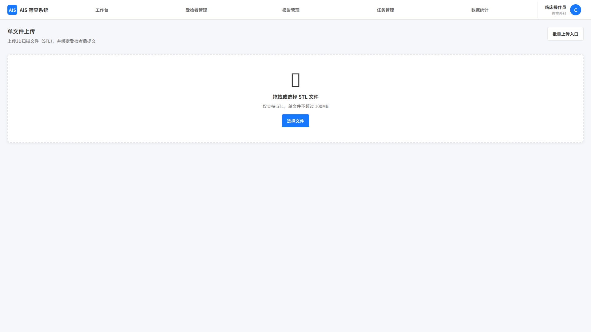
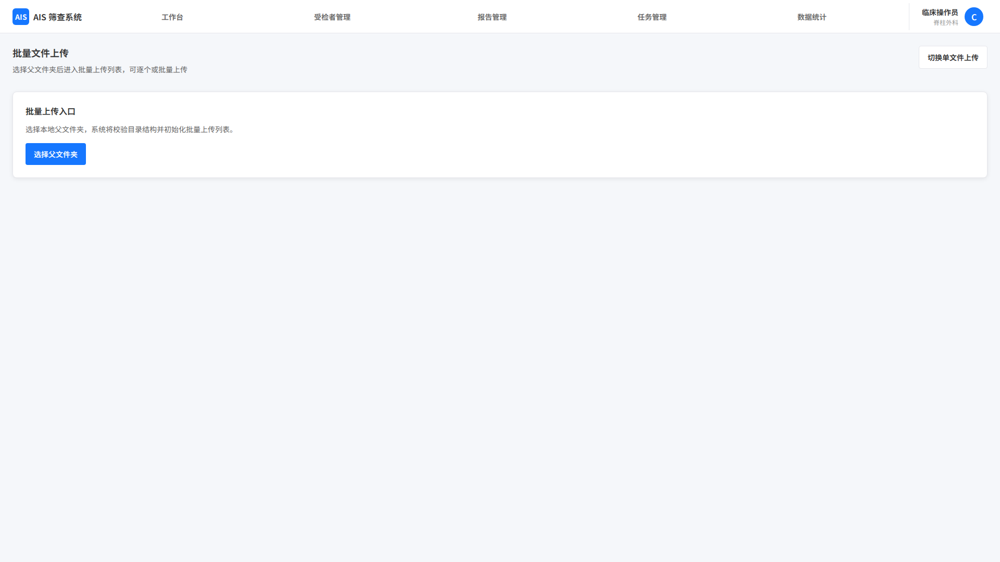

# 文件上传

## 1. 页面范围

本文件覆盖以下页面与能力：

- 单文件上传页
- 批量上传入口
- 批量上传列表页

## 2. 页面定位

文件上传负责将 3D扫描文件接入系统并与受检者建立关联，是“建档-上传-分析-报告”中的关键环节。

## 3. 页面结构

### 3.1 单文件上传页

入口来源：

- 受检者详情页（自动关联当前受检者）
- 单个建档成功弹窗"上传数据"（自动关联刚建档的受检者）
- 独立上传入口（不指定受检者）

流程：

1. 用户选择 3D扫描文件（STL格式）。
2. 系统执行文件校验：
   - 文件格式为 STL
   - 单个文件大小 ≤ 100MB
   - 文件内容完整无损坏
3. 校验失败时给出具体提示并拒绝上传。
4. 校验成功后进入受检者绑定逻辑：
   - **从受检者详情页或建档页进入**：自动与该受检者绑定，无需手动选择；
   - **从独立上传入口进入**：显示带搜索筛选的下拉框，供匹配系统已建档的受检者；若不选择受检者（默认操作），系统自动生成一个"信息未录入"的临时受检者（仅含文件信息、上传时间等），用户可后续进入该受检者详情补充基础信息。
5. 确认绑定关系后，用户点击上传，页面显示上传进度。
6. 上传完成后弹窗提示，可选择：查看受检者详情、继续上传、返回首页。

### 3.2 批量上传页

#### 3.2.1 批量上传入口

流程：

1. 点击"批量上传"，选择本地父文件夹。
2. 系统自动校验该父文件夹下的文件树结构（目录层级与文件命名须符合固定规范）。
3. 校验失败：弹出明确报错提示，说明不符合规范的具体位置，要求重新选择。
4. 校验通过：自动跳转至批量上传列表页，进行后续操作。

#### 3.2.2 批量上传列表页

列表页自动对父文件夹内所有文件完成初始化处理，并允许用户在上传前调整绑定关系。

**文件初始化处理（从入口自动执行后显示列表）：**

1. 逐个对读取到的文件执行校验（格式、大小、完整性、后缀）并计算 hash 值。
2. 对 hash 值与系统已有文件进行比对：
   - **重复文件**：自动标记"已上传"，跳过上传，并在列表中简略显示系统中对应受检者的关键信息；
   - **未上传文件**：列表中展示文件基本信息（文件名、大小、hash 值、路径），提供以下操作：
     - 下拉选择已建档受检者或自动生成未录入受检者（与单文件上传逻辑相同）
     - 单独"上传"按钮，可单独触发上传，上传完成后弹窗提示，列表刷新显示结果。

**列表页右下角操作按钮：**

- **选择匹配文档**：上传指定格式 Excel（与批量建档 Excel 格式一致），系统自动解析文档内受检者信息，将未上传文件匹配至已有受检者或生成新受检者。解析或建档失败时给出明确错误提示，支持修改后重新上传。解析完成后列表刷新，高亮显示匹配/生成成功的条目，但新受检者的信息仅在完成上传后才写入系统。
- **批量上传**：对列表中所有"未上传"状态的文件发起批量上传，完成后弹窗提示上传成功数量、失败数量（可查看失败原因）。
- **取消上传**：退出批量上传流程，返回文件上传入口；若无明确来源则返回工作台。

## 4. 关键规则

- 文件格式仅支持 3D扫描文件（STL格式），单文件大小上限 100MB
- 上传前必须校验格式、后缀和完整性
- 系统必须计算 hash 用于重复识别
- 允许无受检者上下文上传，但需自动生成可追踪的临时受检者
- 重复文件应跳过上传，不得静默覆盖历史文件
- 删除文件不删除历史报告，历史报告保留并标注“关联文件已删除”
- 所有上传、替换、删除、匹配、批量操作都必须记录日志

## 5. 页面截图

