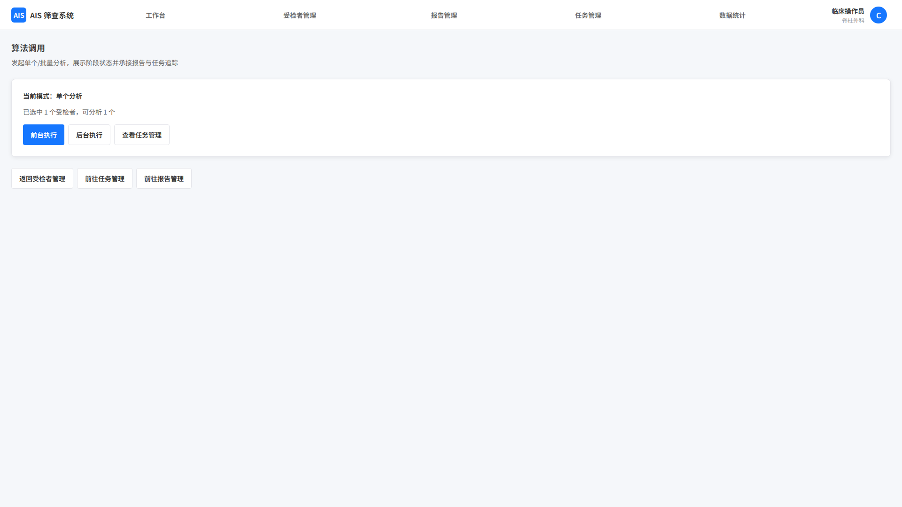

# 算法调用

## 1. 页面范围

本文件覆盖以下页面与能力：

- 单个分析流程
- 批量分析流程
- 批量结果列表页

## 2. 页面定位

算法调用页负责对符合条件的受检者文件发起算法服务请求、展示执行状态并承接结果跳转，不承载算法中间过程展示与设备控制。

## 3. 页面结构

### 3.1 单个分析

流程：

1. 用户发起分析。
2. 系统校验前置条件：受检者已建档且核心必填完整、已关联可用 3D扫描文件。
3. 校验通过后组装参数调用算法接口。
4. 弹窗实时展示阶段状态：等待中、上传中、分析中、分析成功、分析失败、已取消。
5. 用户可选择前台等待或后台执行。
6. 单个分析也需生成单个任务记录，便于在任务管理页统一追踪。
7. 前台等待成功后自动跳转到报告详情页；后台执行则在右下角弹出弱提示，支持跳转任务详情页或最新生成的报告详情页。
8. 失败时展示原因并支持重试。

异常处理：

- 通用异常：接口连接失败、算法服务未响应、分析超时
- 管理员可查看接口错误日志；普通用户仅展示“请联系管理员排查”

### 3.2 批量分析

流程：

1. 用户勾选受检者并发起批量分析。
2. 系统预校验并自动跳过未建档完整或未上传文件的条目。
3. 弹窗提示“共选中 N 个受检者，其中 X 个未建档，Y 个未上传文件，已跳过，剩余 N-X-Y 个可分析”。
4. 用户确认后建立任务队列。
5. 系统按队列逐个发起算法请求。
6. 自动跳转批量结果列表页并实时刷新任务状态、失败原因等。
7. 若选择后台执行，则右下角弱提示可跳转至对应批量任务页。

异常处理：

- 单个受检者异常不影响其他受检者继续分析
- 文件异常、接口异常、算法处理失败均需在列表中体现明确失败原因

## 4. 关键规则

- 本页仅负责发起调用、展示状态、处理异常与跳转结果
- 仅已建档且已上传可用 3D扫描文件（STL格式）的受检者/文件允许发起分析
- 单个文件可多次分析，生成多份报告版本，默认展示最新版本
- 批量分析必须生成任务主记录与子任务记录，状态与日志可追溯
- 通用异常需统一提示口径并支持重试
- 单个分析与批量分析都必须与任务管理页状态保持一致
- 所有发起、取消、重试、后台执行、结果导出动作需保留日志

## 5. 页面截图

