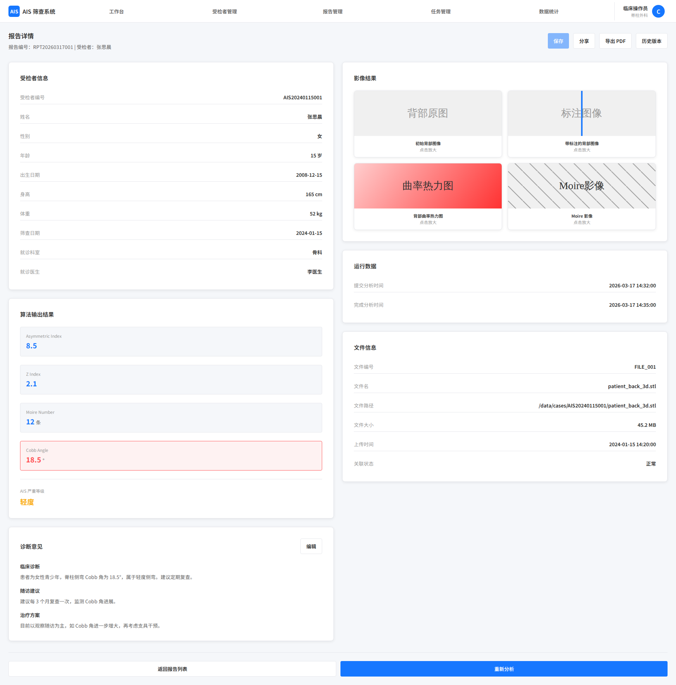

# 报告分析

## 1. 页面范围

本文件覆盖以下页面与能力：

- 报告列表页
- 报告详情页

## 2. 页面定位

报告分析负责将受检者信息、文件信息和算法输出整合为标准化临床报告，支撑查看、编辑、导出、分享与版本追溯。

## 3. 页面结构

### 3.1 报告列表页

列表核心规则：

- 仅展示已生成报告
- 同一文件多版本仅显示最新版本
- 报告不可直接删除
- 关联文件或受检者删除后，报告仍保留并标注状态

列表字段：

- 受检者信息：受检者编号、姓名、性别
- 文件信息：文件编号、扫描时间
- 报告信息：报告编号、生成时间、预测 Cobb Angle、AIS 严重等级
- 删除备注字段：若关联文件或受检者已删除，列表行显示"关联文件/受检者已删除"标注

行内操作：

- 查看报告（进入报告详情，可在详情页切换历史版本）
- 导出报告（PDF，直接导出无需进详情页）
- 重新分析（跳转算法调用，针对该报告关联文件重新发起分析）

列表辅助功能：

- 筛选：按受检者编号、姓名、文件编号、报告生成时间、严重等级筛选；管理员额外支持按操作人、就诊科室筛选
- 排序：可按报告生成时间、预测 Cobb Angle 数值等增/降序排列
- 批量导出：选择多份报告，一键导出为 PDF 压缩包

### 3.2 报告详情页

报告由受检者信息、文件信息、算法输出结果、诊断意见四部分组成，由模板自动生成，诊断意见部分支持手动编辑。

**受检者信息区块：**

- 全部受检者字段（编号、姓名、性别、生日、身高、体重、筛查日期等）；未录入项标注为空。

**文件信息区块：**

- 文件编号、文件名、文件路径、文件大小、上传时间

**算法输出结果区块：**

运行数据：

- 提交分析时间、完成分析时间

量化指标：

- Asymmetric Inde
- Z Index
- Moire Number
- Cobb Angle
- AIS 严重等级：根据 Cobb Angle 划分，阳性标红显示

影像结果：

- 初始背部图像
- Moire 影像
- 背部曲率热力图
- 带标注的背部图像：叠加渲染，标注体表脊柱中线、左右肩峰连线等

**诊断意见区块（可编辑）：**

- 临床诊断
- 随访建议
- 治疗方案（如定期复查、支具治疗、手术建议）

点击"编辑"可修改，保存后生成新版本报告

**顶部操作按钮：**

- 保存（仅在编辑诊断意见后可点击）
- 分享
- 导出 PDF
- 历史版本（弹出历史版本列表，标注版本号、修改人、修改时间，可跳转查看并恢复）

## 4. 关键规则

- 报告以算法输出为基础，诊断意见可编辑并版本化
- 编辑仅影响诊断意见，不修改原始算法结果
- 同一文件允许多次分析并产生多份报告，默认展示最新有效版本
- 报告不可物理删除，需通过关联状态标记实现追溯
- 查看、保存、恢复、导出、分享、重分析等关键动作必须记录日志

## 5. 页面截图

